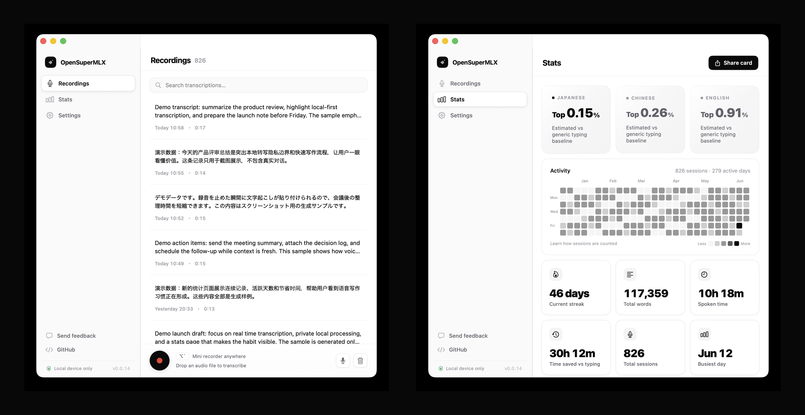

# OpenSuperMLX

Native speech-to-text for macOS. Press a shortcut anywhere, speak, and OpenSuperMLX turns your voice into clean text on your Apple Silicon Mac.

It is built for people who write meeting notes, Slack replies, documents, prompts, and follow-ups faster by talking than by typing.

Install with Homebrew: `brew tap axot/tap && brew install --cask opensupermlx`. Or download from [GitHub releases](https://github.com/axot/OpenSuperMLX/releases).

<p align="center">
  
  <br />
  <sub>Screenshots use synthetic sample data. Full-size: <a href="docs/image.png">Recordings</a> · <a href="docs/stats.png">Stats</a>.</sub>
</p>

## Why Use It

- **Works from any app**: tap or hold a global shortcut, then paste the transcript back where you were writing.
- **Feels native on macOS**: menu-bar app, keyboard-first flow, mic picker, searchable transcript history, and drag-and-drop audio import.
- **Runs locally with MLX**: transcription runs on-device by default through [MLX](https://github.com/ml-explore/mlx-swift); optional LLM correction sends text only to the provider you configure.
- **Handles real multilingual work**: automatic language detection, English/Chinese/Japanese/Korean support, and Asian language autocorrect.
- **Tracks the habit**: a stats dashboard shows sessions, streaks, speaking time, time saved, and estimates against a generic typing-speed baseline.

## Core Workflow

1. Press <kbd>⌥</kbd> + <kbd>&#96;</kbd> from any app.
2. Speak naturally.
3. Release or stop recording.
4. OpenSuperMLX transcribes, cleans up the text, and pastes it into the frontmost app.

Two modes are built in:

| Gesture | Action |
|---|---|
| Tap <kbd>⌥</kbd> + <kbd>&#96;</kbd> | Start or stop recording |
| Hold <kbd>⌥</kbd> + <kbd>&#96;</kbd> | Record only while held |
| Tap <kbd>⌥</kbd> + <kbd>⇧</kbd> + <kbd>&#96;</kbd> | Start or stop recording with LLM correction |
| <kbd>Escape</kbd> | Cancel active recording |

Shortcuts are customizable in **Settings -> Shortcuts**.

## Features

- Real-time streaming transcription so text appears while you speak
- Searchable local transcript history
- Drag-and-drop audio file transcription with queue processing
- Built-in model picker and custom Hugging Face model IDs
- Microphone switching for built-in, external, Bluetooth, and Apple Continuity devices
- Optional AWS Bedrock LLM post-transcription correction
- CLI harness for transcription, diagnostics, queues, models, and benchmarks
- First-launch onboarding for permissions and model setup

## Installation

### Homebrew

```bash
brew tap axot/tap
brew install --cask opensupermlx
```

### Manual

Download the latest build from the [GitHub releases page](https://github.com/axot/OpenSuperMLX/releases).

### macOS Security Approval

OpenSuperMLX is not signed with an Apple Developer ID, so macOS may block the first launch.

1. Open the app.
2. Go to **System Settings -> Privacy & Security**.
3. Find the OpenSuperMLX security message.
4. Click **Open Anyway**.
5. Confirm the dialog.

You only need to do this once.

## Requirements

- macOS 14.0+
- Apple Silicon / ARM64 Mac

## Models

Models are downloaded automatically from Hugging Face when selected in the app.

| Model | Best For |
|---|---|
| **Qwen3-ASR-0.6B-4bit** | Fastest, smallest local model |
| **Qwen3-ASR-1.7B-8bit** | Recommended balance of quality and speed |
| **Qwen3-ASR-1.7B-bf16** | Highest quality |

Custom models can be added with a Hugging Face repository ID.

## CLI

The app binary also works as a headless CLI harness. It supports `transcribe`, `stream-simulate`, `correct`, `config`, `recordings`, `queue`, `mic`, `model`, `benchmark`, and `diagnose`.

```bash
BINARY=build/Build/Products/Debug/OpenSuperMLX.app/Contents/MacOS/OpenSuperMLX
$BINARY diagnose --json
$BINARY help transcribe
```

See [docs/cli.md](docs/cli.md) for the full command reference.

## Building Locally

```bash
git clone git@github.com:axot/OpenSuperMLX.git
cd OpenSuperMLX
git submodule update --init --recursive
brew install cmake libomp rust ruby
gem install xcpretty
./run.sh build
```

For CI build details, see [.github/workflows/build.yml](.github/workflows/build.yml).

## Support

If you run into an issue:

1. Search existing GitHub issues.
2. Open a new issue with reproduction steps.
3. Include system information and relevant logs.

## Acknowledgments

OpenSuperMLX is forked from [OpenSuperWhisper](https://github.com/Starmel/OpenSuperWhisper) by [@Starmel](https://github.com/Starmel). Thanks to the original project for the foundation.

## License

OpenSuperMLX is licensed under the MIT License. See [LICENSE](LICENSE) for details.
