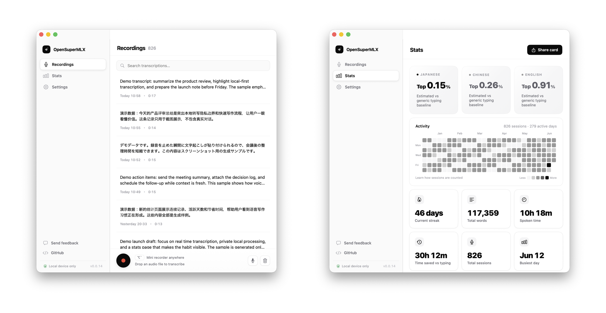

# OpenSuperMLX

Native speech-to-text for macOS. Press a shortcut anywhere, speak, and OpenSuperMLX turns your voice into clean text on your Apple Silicon Mac.

It is built for people who write meeting notes, Slack replies, documents, prompts, and follow-ups faster by talking than by typing.

Install with Homebrew: `brew tap axot/tap && brew install --cask opensupermlx`. Or download from [GitHub releases](https://github.com/axot/OpenSuperMLX/releases).

<p align="center">
  
  <br />
  <sub>Screenshots use synthetic sample data. Full-size: <a href="docs/image.png">Recordings</a> · <a href="docs/stats.png">Stats</a>.</sub>
</p>

## Why Use It

- **Works from any app**: tap or hold a global shortcut, then paste the transcript back where you were writing.
- **Feels native on macOS**: menu-bar app, keyboard-first flow, mic picker, searchable transcript history, and drag-and-drop audio import.
- **Runs locally with MLX**: transcription runs on-device by default through [MLX](https://github.com/ml-explore/mlx-swift); optional LLM correction sends text only to the provider you configure.
- **Handles real multilingual work**: automatic language detection, 19 selectable languages, and Asian autocorrect for Chinese, Japanese, and Korean.
- **Tracks the habit**: a stats dashboard shows sessions, streaks, speaking time, time saved, and estimates against a generic typing-speed baseline.

## Core Workflow

1. Press <kbd>⌥</kbd> + <kbd>&#96;</kbd> from any app.
2. Speak naturally.
3. Release or stop recording.
4. OpenSuperMLX transcribes, cleans up the text, and pastes it into the frontmost app.

Two modes are built in:

| Gesture | Action |
|---|---|
| Tap <kbd>⌥</kbd> + <kbd>&#96;</kbd> | Start or stop recording |
| Hold <kbd>⌥</kbd> + <kbd>&#96;</kbd> | Record only while held |
| Tap <kbd>⌥</kbd> + <kbd>⇧</kbd> + <kbd>&#96;</kbd> | Start or stop recording with LLM correction |
| <kbd>Escape</kbd> | Cancel active recording |

Shortcuts are customizable in **Settings -> Shortcuts**.

## Features

- Real-time streaming transcription so text appears while you speak
- Searchable local transcript history
- Space-efficient captured recordings stored as 16 kHz mono AAC/M4A at 48 kbps, with existing WAV and M4A history still supported; imported audio keeps its original format
- Recoverable finalization: streaming capture retains PCM for retry, while completed non-streaming M4A files can retry installation and history persistence
- Drag-and-drop audio file transcription with queue processing
- Optional system-audio capture when using headphones; speaker output automatically falls back to mic-only capture to avoid echo
- Built-in model picker and custom Hugging Face model IDs
- Microphone switching for built-in, external, Bluetooth, and Apple Continuity devices
- Optional AWS Bedrock or OpenAI-compatible post-transcription correction
- CLI harness for transcription, diagnostics, queues, models, and benchmarks
- Opt-in local Transcript MCP bridge for agent access to live transcript sessions
- First-launch onboarding for permissions and model setup

## Installation

### Homebrew

```bash
brew tap axot/tap
brew install --cask opensupermlx
```

### Manual

Download the latest build from the [GitHub releases page](https://github.com/axot/OpenSuperMLX/releases).

### macOS Security Approval

Official GitHub releases are signed with an Apple Developer ID and notarized by Apple. Download the DMG, install the app normally, and open it.

On first launch, macOS will request microphone and accessibility permissions. Grant them so OpenSuperMLX can record audio and paste transcripts into other apps.

System-audio capture also requires Screen Recording permission when you enable that feature.

## Requirements

- macOS 15.0+
- Apple Silicon / ARM64 Mac

## Models

Models are downloaded automatically from Hugging Face when selected in the app.

| Model | Best For |
|---|---|
| **Qwen3-ASR-0.6B-4bit** | Fastest, smallest local model |
| **Qwen3-ASR-1.7B-8bit** | Recommended balance of quality and speed |
| **Qwen3-ASR-1.7B-bf16** | Highest quality |

Custom models can be added with a Hugging Face repository ID.

## CLI

The app binary also works as a headless CLI harness. It supports `transcribe`, `stream-simulate`, `correct`, `config`, `recordings`, `queue`, `mic`, `model`, `benchmark`, and `diagnose`.

```bash
BINARY=build/Build/Products/Debug/OpenSuperMLX.app/Contents/MacOS/OpenSuperMLX
$BINARY diagnose --json
$BINARY help transcribe
```

See [docs/cli.md](docs/cli.md) for the full command reference.

## Building Locally

```bash
git clone git@github.com:axot/OpenSuperMLX.git
cd OpenSuperMLX
git submodule update --init --recursive
brew install cmake libomp rust ruby
gem install xcpretty
./run.sh build
```

For Swift-only changes after the initial build, use the fast incremental `xcodebuild` command in [AGENTS.md](AGENTS.md). Use `./run.sh` to rebuild every native component and launch the app, or `./run.sh build` to build without launching.

For CI build details, see [.github/workflows/build.yml](.github/workflows/build.yml).

## Support

If you run into an issue:

1. Search existing GitHub issues.
2. Run the CLI's `diagnose --json` command and collect relevant unified logs using [docs/logging.md](docs/logging.md).
3. Open a new issue with reproduction steps and the diagnostic output.

If a **Recording Not Saved** panel appears, free disk space or fix the storage problem, then choose **Retry**. **Copy Transcript** preserves the text on the clipboard; **Cancel Save** permanently discards the recoverable audio and transcript after confirmation. See [docs/audio-diagnostics.md](docs/audio-diagnostics.md) for recording analysis and recovery details.

## Acknowledgments

OpenSuperMLX is forked from [OpenSuperWhisper](https://github.com/Starmel/OpenSuperWhisper) by [@Starmel](https://github.com/Starmel). Thanks to the original project for the foundation.

## License

OpenSuperMLX is licensed under the MIT License. See [LICENSE](LICENSE) for details.
