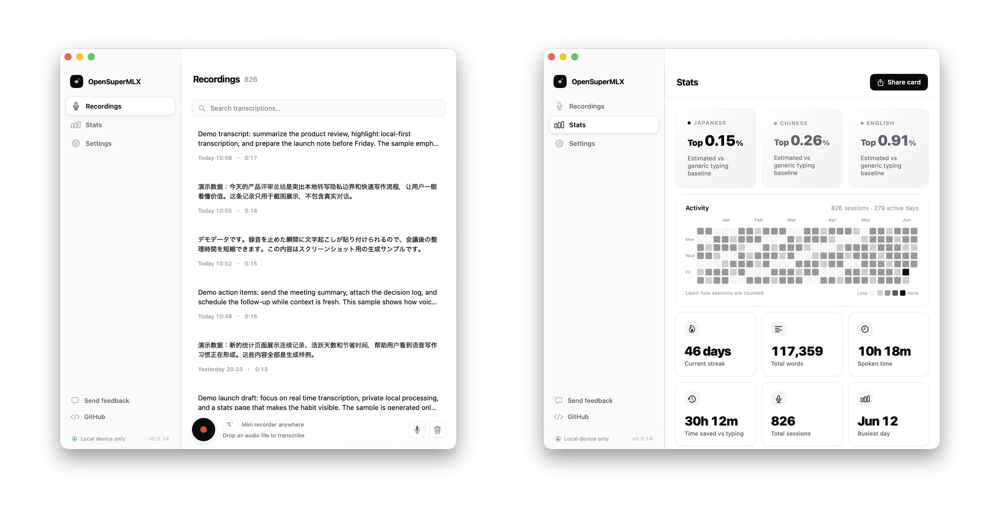

<h1 align="center">OpenSuperMLX</h1>

<p align="center">
  <b>Private, real-time dictation for your Mac.</b><br />
  Press a shortcut in any app, speak, and your words appear where you're typing.<br />
  Transcribed on your Mac, never uploaded.
</p>

<p align="center">
  <a href="https://github.com/axot/OpenSuperMLX/releases/latest"></a>
  
  
  <a href="LICENSE"></a>
</p>

<p align="center">
  <code>brew tap axot/tap && brew install --cask opensupermlx</code><br />
  or download the DMG from the <a href="https://github.com/axot/OpenSuperMLX/releases/latest">latest release</a>
</p>

<p align="center">
  
</p>

## How it works

1. In any app, press <kbd>⌥</kbd> + <kbd>&#96;</kbd>, or hold it while you talk.
2. Speak. The text appears live as you go.
3. Stop, and the transcript is pasted where your cursor is.

## Why OpenSuperMLX

- **Private by design.** Speech recognition runs entirely on your Mac, using Qwen3-ASR on [MLX](https://github.com/ml-explore/mlx-swift) and the Neural Engine. There's no account and no subscription, and your audio is never sent anywhere.
- **Works wherever you type.** Slack, email, documents, your editor, an AI chat box: one global shortcut, and the text lands in the app you're using.
- **Real time, even in long sessions.** Words stream in while you talk, and long meetings keep transcribing.
- **Made for multilingual speakers.** It detects the language automatically across 19 languages, fixes spacing and punctuation for Chinese, Japanese, and Korean, and writes numbers as digits in Chinese and English.
- **Recordings you can come back to.** Every session is kept, with its audio, in a searchable history. If a save fails, you can retry instead of losing the take. You can also drop in an existing audio file to transcribe it.
- **Optional LLM cleanup.** A second shortcut sends only the text to your own AWS Bedrock or OpenAI-compatible model to fix misheard words and punctuation.

## Made for

- **Writing faster**: meeting notes, chat replies, prompts, documents, and follow-ups.
- **Meetings and calls**: with headphones on, OpenSuperMLX can record your microphone and the other side of the call together.
- **Developers and AI agents**: a local MCP server lets agents list, search, and follow live transcripts, and a CLI covers transcription, benchmarks, and diagnostics.

## Features

**Dictation**
- Tap the shortcut to start and stop, or hold it to record only while it's pressed. Press <kbd>Escape</kbd> to cancel.
- Live streaming transcription.
- Switch between built-in, USB, Bluetooth, and Continuity microphones.
- Optional system-audio capture with headphones. On speakers it records the microphone only, to avoid echo.

**Text**
- Automatic language detection, or pick one of 19 languages.
- Asian autocorrect for Chinese, Japanese, and Korean.
- Numbers, dates, and amounts written as digits (inverse text normalization) for Chinese and English.
- Optional LLM correction through AWS Bedrock or any OpenAI-compatible API. Long transcripts are split to fit the model's limits.

**History and stats**
- Searchable transcript history. Regenerate any transcript from its audio.
- Recordings stored as 16 kHz mono AAC at 48 kbps. Imported audio keeps its original format.
- Drag and drop audio files to transcribe them in a queue.
- A stats dashboard with sessions, streaks, spoken time, and time saved compared with typing.

**Reliability**
- If a recording can't be saved, a recovery panel lets you retry, copy the transcript, or discard it.
- Signed with an Apple Developer ID and notarized by Apple.
- Automatic updates that wait until you've finished recording.

**For developers**
- A headless CLI: `transcribe`, `stream-simulate`, `correct`, `config`, `recordings`, `queue`, `mic`, `model`, `benchmark`, and `diagnose`.
- An opt-in Transcript MCP server on `127.0.0.1` for agent access to live transcripts.

## Install

### Homebrew

```bash
brew tap axot/tap
brew install --cask opensupermlx
```

### Download

Download the DMG from the [latest release](https://github.com/axot/OpenSuperMLX/releases/latest), open it, and drag OpenSuperMLX to Applications.

### Permissions

On first launch, macOS asks for microphone and accessibility access. OpenSuperMLX needs both: the microphone to record, and accessibility to paste text into other apps. Capturing system audio also needs Screen Recording permission.

### Updates

OpenSuperMLX checks GitHub releases once a day and shows an update window when a new version is available. The window waits until you finish recording and stop typing, and the app restarts to install only when nothing is being recorded, saved, or transcribed. Choose **Check for Updates…** in the menu bar menu to check now, or turn off **Settings → Advanced → Check for updates automatically**.

Version 0.1.1 and earlier can't update themselves: install the next release once from the [releases page](https://github.com/axot/OpenSuperMLX/releases) or with `brew upgrade --cask opensupermlx`. Homebrew installs keep working with `brew upgrade` as before.

## Requirements

- macOS 15 or later
- A Mac with Apple Silicon

## Model

OpenSuperMLX uses **Qwen3-ASR-1.7B-5bit** (about 1.8 GB), downloaded from Hugging Face during first-launch setup.

**Settings → Model → Neural Engine audio encoder** (on by default) runs the model's audio encoder on the Neural Engine instead of the GPU. The first time the model loads, the app downloads a Core ML version of the encoder (about 300 MB). Turn the setting off to use the GPU encoder instead.

## Shortcuts

| Shortcut | Action |
|---|---|
| Tap <kbd>⌥</kbd> + <kbd>&#96;</kbd> | Start or stop recording |
| Hold <kbd>⌥</kbd> + <kbd>&#96;</kbd> | Record only while held |
| Tap <kbd>⌥</kbd> + <kbd>⇧</kbd> + <kbd>&#96;</kbd> | Start or stop recording with LLM correction |
| <kbd>Escape</kbd> | Cancel the active recording |

Change them in **Settings → Shortcuts**.

## CLI

The app binary doubles as a headless CLI:

```bash
BINARY=build/Build/Products/Debug/OpenSuperMLX.app/Contents/MacOS/OpenSuperMLX
$BINARY diagnose --json
$BINARY help transcribe
```

See [docs/cli.md](docs/cli.md) for the full command reference.

## Build from source

```bash
git clone git@github.com:axot/OpenSuperMLX.git
cd OpenSuperMLX
git submodule update --init --recursive
brew install cmake libomp rust ruby
gem install xcpretty
./run.sh build
```

After the first build, Swift-only changes can use the faster incremental `xcodebuild` command in [AGENTS.md](AGENTS.md). `./run.sh` rebuilds every native component and launches the app, and `./run.sh build` builds without launching.

## Support

If something goes wrong:

1. Search the existing GitHub issues.
2. Run `diagnose --json` from the CLI and collect the relevant logs as described in [docs/logging.md](docs/logging.md).
3. Open a new issue with the steps to reproduce it and the diagnostic output.

If a **Recording Not Saved** panel appears, free up disk space or fix the storage problem, then choose **Retry**. **Copy Transcript** puts the text on the clipboard. **Cancel Save** permanently discards the audio and transcript, after asking you to confirm. See [docs/audio-diagnostics.md](docs/audio-diagnostics.md) for details on recording analysis and recovery.

## Acknowledgments

OpenSuperMLX is forked from [OpenSuperWhisper](https://github.com/Starmel/OpenSuperWhisper) by [@Starmel](https://github.com/Starmel). Thanks to the original project for the foundation.

## License

OpenSuperMLX is released under the MIT License. See [LICENSE](LICENSE) for details.
