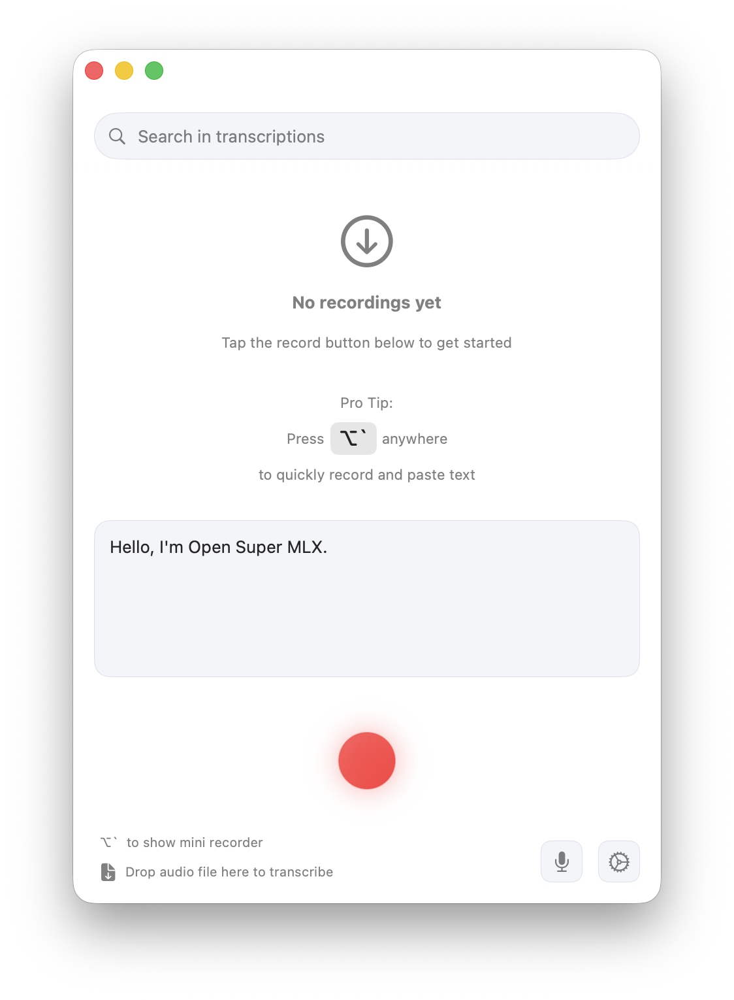

# OpenSuperMLX

OpenSuperMLX is a macOS application that provides real-time audio transcription powered by [MLX](https://github.com/ml-explore/mlx-swift) on Apple Silicon. It offers a seamless way to record and transcribe audio with customizable settings and keyboard shortcuts.

## Features

- 🎙️ Real-time audio recording and transcription
- 🔴 Streaming transcription — see results as you speak
- 🧠 MLX-based transcription engine — download models directly from the app
- ⌨️ Global keyboard shortcuts — key combination or single modifier key (e.g. Left ⌘, Right ⌥, Fn)
- ✊ Hold-to-record mode — hold the shortcut to record, release to stop
- 📁 Drag & drop audio files for transcription with queue processing
- 🎤 Microphone selection — switch between built-in, external, Bluetooth and iPhone (Apple Continuity) mics from the menu bar
- 🌍 Support for multiple languages with auto-detection
- 🇯🇵🇨🇳🇰🇷 Asian language autocorrect ([autocorrect](https://github.com/huacnlee/autocorrect))
- 🤖 AWS Bedrock LLM post-transcription correction (optional)
- 👋 First-launch onboarding flow

## Installation

Download from [GitHub releases page](https://github.com/axot/OpenSuperMLX/releases).

## Requirements

- macOS 15.1+ (Apple Silicon/ARM64)

## Support

If you encounter any issues or have questions, please:
1. Check the existing issues in the repository
2. Create a new issue with detailed information about your problem
3. Include system information and logs when reporting bugs

## Building locally

To build locally, you'll need:

    git clone git@github.com:axot/OpenSuperMLX.git
    cd OpenSuperMLX
    git submodule update --init --recursive
    brew install cmake libomp rust ruby
    gem install xcpretty
    ./run.sh build

In case of problems, consult `.github/workflows/build.yml` which is our CI workflow
where the app gets built automatically on GitHub's CI.

## Contributing

Contributions are welcome! Please feel free to submit pull requests or create issues for bugs and feature requests.

### Contribution TODO list

- [x] Streaming transcription ([#22](https://github.com/axot/OpenSuperMLX/issues/22))
- [ ] Custom dictionary ([#35](https://github.com/axot/OpenSuperMLX/issues/35))
- [ ] Intel macOS compatibility ([#16](https://github.com/axot/OpenSuperMLX/issues/16))
- [ ] Agent mode ([#14](https://github.com/axot/OpenSuperMLX/issues/14))
- [x] Background app ([#9](https://github.com/axot/OpenSuperMLX/issues/9))
- [x] Support long-press single key audio recording ([#19](https://github.com/axot/OpenSuperMLX/issues/19))

## License

OpenSuperMLX is licensed under the MIT License. See the [LICENSE](LICENSE) file for details.

## Acknowledgments

OpenSuperMLX is forked from [OpenSuperWhisper](https://github.com/Starmel/OpenSuperWhisper) by [@Starmel](https://github.com/Starmel). Thanks to the original project for providing the foundation for this work.

## Models

MLX models are downloaded automatically from Hugging Face when selected in the app. Built-in models:

- **Qwen3-ASR-0.6B-4bit** — Smallest model, fastest inference
- **Qwen3-ASR-1.7B-8bit** — Recommended balance of accuracy and speed
- **Qwen3-ASR-1.7B-bf16** — Highest quality, best accuracy

Custom models can be added via HuggingFace repository ID.
